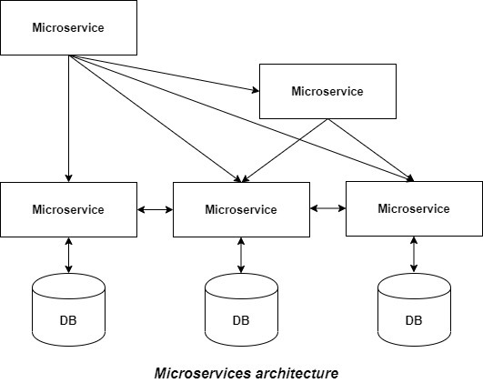

### 1. What is a Microservice?

- Micro Service is an architecture that
  allows the developers to develop and
  deploy services independently.
- Each service
  running has its own process and this
  achieves the lightweight model to
  support business applications.

- esme alag alag programming language me different project bana skate hai, aur sabko aapas me combine kar sakte hai taki jyada dikkkat nahi ho.

- sabka apna apna alag alag database bhi ho sakta hai

#### i. How are microservices s/w connected?

- Microservices are often connected via APIs and can leverage many of the same tools and solutions that have grown in the RESTful and web service ecosystem.

- The most common type is single-receiver communication with a synchronous protocol like HTTP/HTTPS when invoking a regular Web API HTTP service. Microservices also typically use messaging protocols for asynchronous communication between microservices.

### 2. What is Monolith architecture?

- ek hi project ke andaar sab kuch service daal dete hai. `kuch bhi change karna ho toh full project wapis se re-deploy karna padega`

- A monolithic architecture is a traditional model of a software program, which is built as a unified unit that is self-contained and independent from other applications. The word “monolith” is often attributed to something large and glacial, which isn't far from the truth of a monolith architecture for software design.

### 3. What is the difference between Monolith and Microservice?

1. `Monolith architecture`

- this is the diagram of monolith, all functionalities under single project.

  

  #### disadvantages of monolith architecture

  - It becomes too large with time and hence, difficult to manage.even for a small change,
    we need to redeploy the whole application.

  - For any new developer joining the project, it is very difficult to understand the logic of a large Monolithic application even if his responsibility is related to a single functionality.

  - It is very difficult to adopt any new technology which is well suited for a particular functionality as it affects the entire application, both in terms of time and cost.

  - It is not very reliable, as a single bug in any module can bring down the entire monolithic application.

  #### advantages of monolith architecture

  - Simple to develop relative to microservices, where skilled developers are required in order to identify and develop the services.

  - The problems of network latency and security are relatively less in comparison to microservices architecture.

  - Developers need not learn different applications, they can keep their focus on one application

  ***

2. `Microservice Architecture`

- It is an architectural development style in which the application is made up of smaller services that handle a small portion of the functionality and data by communicating with each other directly using lightweight protocols like HTTP. According to Sam Newman, `“Microservices are the small services that work together"`.

- Instead of sharing a single database with other microservices, each microservice has its own database. It often results in duplication of some data, but having a database per microservice is essential if you want to benefit from this architecture, as it ensures loose coupling.

- Another advantage of having a separate database per microservice is that each microservice can use the type of database best suited for its needs. Each service offers a secure module boundary so that different services can be written in different programming languages.



#### Disadvantages of microservice architecture

- Being a distributed system, it is much more complex than monolithic applications. Its complexity increases with the increase in a number of microservices.

- Skilled developers are required to work with microservices architecture, which can identify the microservices and manage their inter-communications

- Microservices are costly in terms of network usage as they need to interact with each other and all these remote calls result in network latency.

#### Advantages of microservice architecture

- If there’s any update in one of the microservices, then we need to redeploy only that microservice.

- It is very easy for a new developer to onboard the project as he needs to understand only a particular microservice providing the functionality he will be working on and not the whole system.

- If a particular microservice is facing a large load because of the users using that functionality in excess, then we need to scale out that microservice only. Hence, the microservices architecture supports horizontal scaling.

- Each microservice can use different technology based on the business requirements

### 4. Why do we need a useEffect Hook?

- ```javascript
  import { useEffect } from "react";
  ```

- useEffect is a React Hook that lets you synchronize a component with an external system.

- Whenever there's a change in state or props our componenet re-renders. Therefore, if there's an API call it will get called after every render . To prevent this, we pass every external things into it

- renders -> `useEffect(()=>{},dependency)` hook is called after render
- the number of times it will be called depends upon dependency
- to clean up write all the clean function inside this code and inside useEffect

  ```javascript
  return () => {};
  ```

  - It should return a cleanup function with cleanup code that disconnects from that system once you switch the page.

- `dependencies`
  1. `useEffect(()=>{}) `- It will run after every render
  2. `useEffect(()=>{},[])` - It will run only once after 1st render
  3. `useEffect(()=>{},[a,b])` - now it is dependent on a & b and any changes to these value will make the hook re-run

### 5. What is Optional Chaining? `?.`

- The optional chaining (?.) operator accesses an object's property or calls a function.
- If the object accessed or function called using this operator is undefined or null, the expression short circuits and evaluates to undefined instead of throwing an error `console pe error aur app crash hone se bachata hai`

### 6. What is Shimmer UI?

- It's a good practice to have it. warna agar kuch bhi achaanak se pop up hojae to kitna khabar experience hoga
- A shimmer UI resembles the page's actual UI, so users will understand how quickly the web or mobile app will load even before the content has shown up.
- It gives people an idea of what's about to come and what's happening (it's currently loading) when a page full of content/data takes more than 3 - 5 seconds to load.

### 7. What is the difference between JS expression and JS statement?

- Expressions produce a value, and that value will be passed into the function.
- Statements don't produce a value, and so they can't be used as function arguments

### 8. What is Conditional Rendering, explain with a code example?

- Your components will often need to display different things depending on different conditions.

- In React, you can conditionally render JSX using JavaScript syntax like if statements, &&, and ? : operators.

```javascript
if (!restaurant) return <Shimmer/> or null;
if( hasData) load the actual data.

we can combine it with ternary
return (!restaurant)? <Shimmer/>: return JSX;

`{} en curly braces me sirf aur sirf expression chahiye`

```

- For example, say you don’t want to show packed items at all. A component must return something. In this case, you can return null.

```javascript
if (!restaurant) {
  return null;
}
```

### 9. What is CORS?

- Cross-origin resource sharing -- ` enable cross-origin HTTP requests`
- when we have different origin(domain, scheme, or port) we need some additional `http headers` to share resources with one another wbe app.
  - same origin -- easily sharing of resoruces
  - different origin -- need CORS mechanism
- for the first time a `preflight call` is made.
- CORS also relies on a mechanism by which browsers make a "preflight" request to the server hosting the cross-origin resource, in order to check that the server will permit the actual request.
- In that preflight, the browser sends headers that indicate the HTTP method and headers that will be used in the actual request.
- An example of a cross-origin request: the front-end JavaScript code served from https://domain-a.com uses XMLHttpRequest to make a request for https://domain-b.com/data.json.

### 10. What is async and await?

- The async and await keywords enable asynchronous, promise-based behavior to be written in a cleaner style, avoiding the need to explicitly configure promise chains. Async functions may also be defined as expressions

- `async`
  - makes sure that function is now asynchronous, it will run in background to fetch data.
- `await`
  - This makes the code wait at that point until the promise is settled, at which point the fulfilled value of the promise is treated as a return value, or the rejected value is thrown.

### 11. What is the use of `const json = await data.json();` in getRestaurants()

- the fetch function returns the value of promise in JSON format
- therefore it is necessary to convert it into javascript object.
- A Promise that resolves to a JavaScript object. This object could be anything that can be represented by JSON — an object, an array, a string, a number
