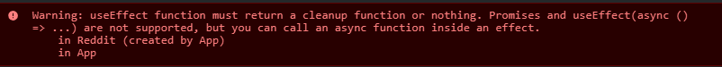

- use `rafce` shortcut to create boilerplate of component

### 1. How do you create Nested Routes react-router-dom cofiguration?

- ```javascript
  import {
    createBrowserRouter,
    Link,
    Outlet,
    routeProvider,
  } from "react-router-dom";
  ```
- to link certain pages, we'll need to create routing configration
- `createBrowserRouter` will take array and in them , pass each configuration in form of objects
- to created nested routing, well need to pass `children` as configuration
- well need a component `<Outlet/>` where all the paths will be displayed
- all the children configurations will go into Outlet .

- ```javascript
  const appRouter = createBrowserRouter([
    {
      path: "/",
      element: <AppLayout />,
      children: [
        {
          path: "about",
          element: <About />,
          children: [
            {
              path: "profile",
              element: <Profile />,
            },
          ],
        },
        {
          path: "/",
          element: <Body />,
        },
      ],
    },
  ]);
  ```

- Here we created the children of `About component` -`javascript
  ```javascript
  {
    path:"about",
    element:<About/>
    children:[{
      path:"profile",
      element:<Profile/>
    }]
  }
  ```
- here `Profile` component is the child of `About`component. tehrefore to render it, About component must need to have an Outlet component.

- ` saara child component sirf apne parent ke <Outlet /> me render hoga`

### 2. What is createHashRouter, createMemoryRouter in React Router docs?.

- createHashRouter

  - This router is useful if you are unable to configure your web server to direct all traffic to your React Router application.
  - Instead of using normal URLs, it will use the hash (#) portion of the URL to manage the "application URL".

- createMemoryRouter
  - Instead of using the browser's history, a memory router manages its own history stack in memory.
  - It's primarily useful for testing and component development tools like Storybook, but can also be used for running React Router in any non-browser environment.

### 3. What is the order of life cycle method calls in Class Based Components?


- It consists of two phases

  1. render phase- constructor() & render() methods are called here.
  2. commit phase- place where React is modifying our DOM.

- Mounting -putting elements on DOM (componentDidMount() esme milega)
- Updating - re-rendering based on state change, props changs,forceUpdate. (componentDidUpdate() esme milega)
- Unmonting - removing elements from DOM `jab hum ek page/component se dusre me jaye tab` .(componentDidUnmount() esme milega)

1. Life cycyle of 1 parent And 1 child

   1. Parent's constructor is called
   1. Parent's render is called
      1. Child constructor()
      1. Child render()
         _(DOM gets updated)_
         _(API is called)_
      1. child componentDidMount()
   1. parent's componentDidMount()

2. Life cycle of 1 Parent and 2 Child

```javascrit
<Child1/>
<Child2/>
```

1. Parent constructor()
2. Parent render()
   1. child1 constructor()
   2. child1 render()
   3. child2 constructor()
   4. child2 render()
      _(DOM gets updated)_
      _(API is called)_
   5. child1 componentDidMount()
   6. child2 componentDidMount()
3. Parent componentDidMount()

- `sare child component ka render phase khatam hone ke baad hi react will update the DOM`

  - necessary quki agar aisa nahi kiya toh ksi ka API call ho raha toh baankiyo ka render hi nahi karega

- constructor()-->1st render() ` DOM updates`-->componentDidMount()
- updation()-->re-render() ` DOM updates again` -->componentDidUpdate()
- `NOTES`
  -DOM will be updated after every render
  - componentDidMount() will be called `only once` after first render
  - componentDidUpdate will be called `only if there is an update`
  - update will happen only if
    1. state changes
    2. change in props
    3. forceUpdate()

### 4. Why do we use componentDidMount?

- componentDidMount() will be called `only once` after first render
- It is the place where we'll make an API call
- constructor()-->1st render() ` DOM updates`-->componentDidMount() (only once)

### 5. Why do we use componentWillUnmount? Show with example

- This method is called when a component is being removed from the DOM
- We need to clea background tasks that'll slow down our app.
- therefore to `cleanup` ,componentWillUnmount() is called when we leave the page or switch the components.
- You should not call setState() in componentWillUnmount() because the component will never be re-rendered. Once a component instance is unmounted, it will never be mounted again.

  ```javascript
  import React from "react";
  export default class XYZ extends React.Component {
    constructor(props) {
      super(props);
      this.state = {};
    }
    componentDidMount(){
      const timer=setTimer(()=>{
        console.log('hello')
      },1000)
    }
    render(){
      return(
        <div>
           <h1>Hello</h1>
        </div>
      )
    }
    <!-- we need to do some clean-up else yeh bg me run hote rahega -->
    componentWillUnmount(){
      closeTimer(timer)
    }
  }
  ```

### 6. Why do we use super(props) in constructor?

- It is used when we need to access a few variables in the parent class. It returns an object which represents the parent class.
- even if you call super() without the props argument, you’ll still be able to access this.props in the render and other methods.
- but wen need to understand the difference between super() and super(props) . if we do only super()
  - React would later assign this.props after your constructor has run. But this.props would still be undefined between the super call and the end of your constructor
  - that’s why I recommend always passing down super(props)

7. ### Why can't we have the callback function of useEffect async?

- when you use async function, it returns a promise and useEffect doesn't expect the callback function to return Promise, rather it expects that nothing is returned or a function is returned.
- ```javascript
  // Warning: Effect callbacks are synchronous to prevent race conditions
  useEffect(async () => {
    const products = await fetch(`${API_URL}/products.json`);
    setProducts(products);
  }, []);
  ```
- if you do this, you'll get an error
  
